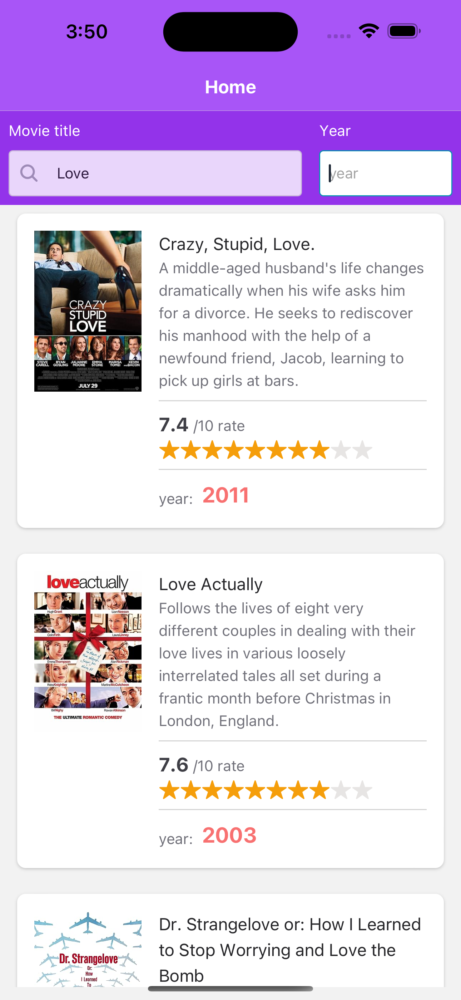
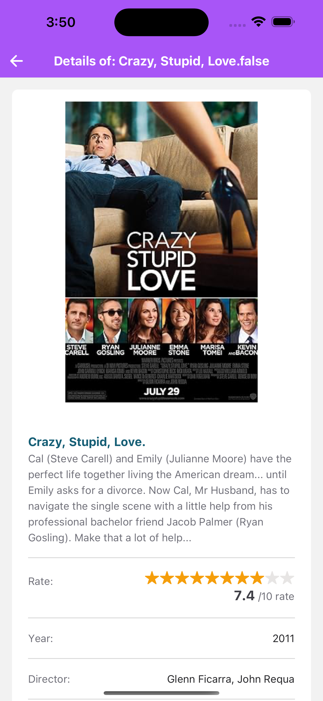
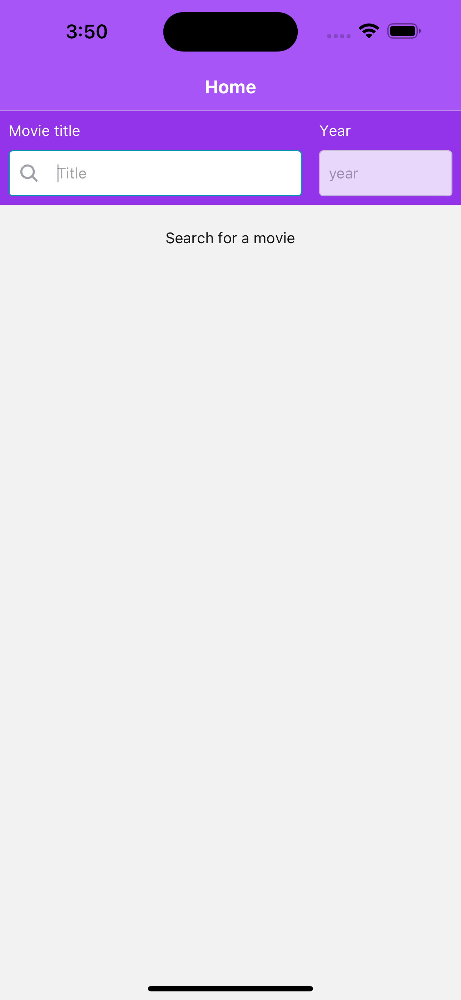
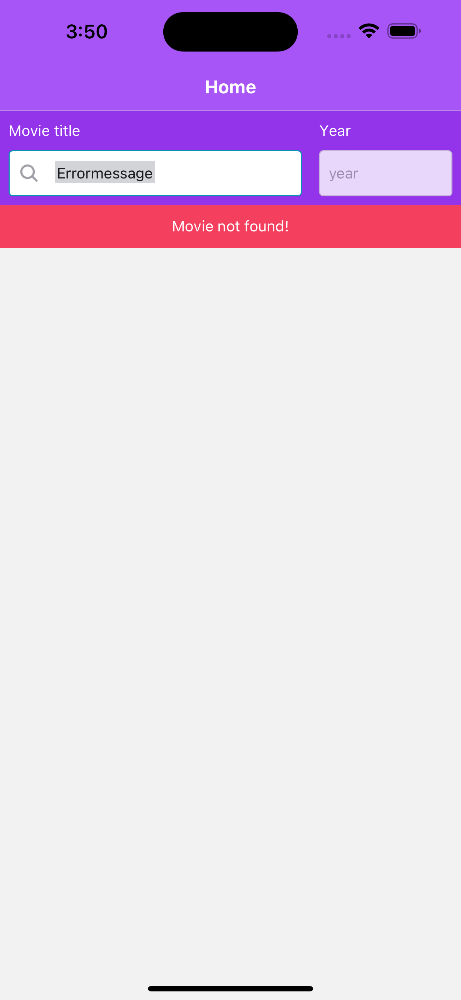

# Movie App
This is a React Native project developed to list movies and their details.

## The challenge
- Use React or React Native (if using React Native, use CLI)
- Preferably use TypeScript
- Use the [OMDB API](http://www.omdbapi.com/) to fetch movie data
- Implement a search feature
- Implement a list view displaying:
  - Image
  - Title
  - Rating
  - Short description
- Implement a movie detail screen displaying:
  - Image(s)
  - Name
  - Rating
  - Long description
  - Director
  - List of actors
  - Any other relevant details
- Use state management tools like Redux, Zustand, MobX, etc.
  
## Technologies Used
- React/React Native
- TypeScript
- Redux
- Native Base

- #### How to start:
- Clone this repo
- Jump to the project folder
- Create a .env file from a .env.example. In root directory -> cp .env.example .env 
- Install dependecies -> yarn install
- Run - yarn ios / yarn android

## Additional Notes
- Ensure that the OMDB API key is properly configured for API requests.
- OMDB API key is inside .env.example you just need create a new .env file.

#### Demo video
https://github.com/massuiabigdog/Itti-Challenge/assets/16282589/55613001-b7d5-447c-8f98-b4f00445428d

#### Screens

  
  
  
  

### Let's work together! 

Hi! My name is Thiago Massuia, I'm a fullstack developer with a focus on React and NodeJS.
I'm passionate about JavaScript and I have a lot of experience working with it.
I also have fluency in English, Portuguese, and Spanish.

You can take a look at my website to know more about me:
- Online Presentation - https://tmassuia.com/
- Portfolio - https://projects.tmassuia.com/
- Linkedin - https://www.linkedin.com/in/tmassuia/

